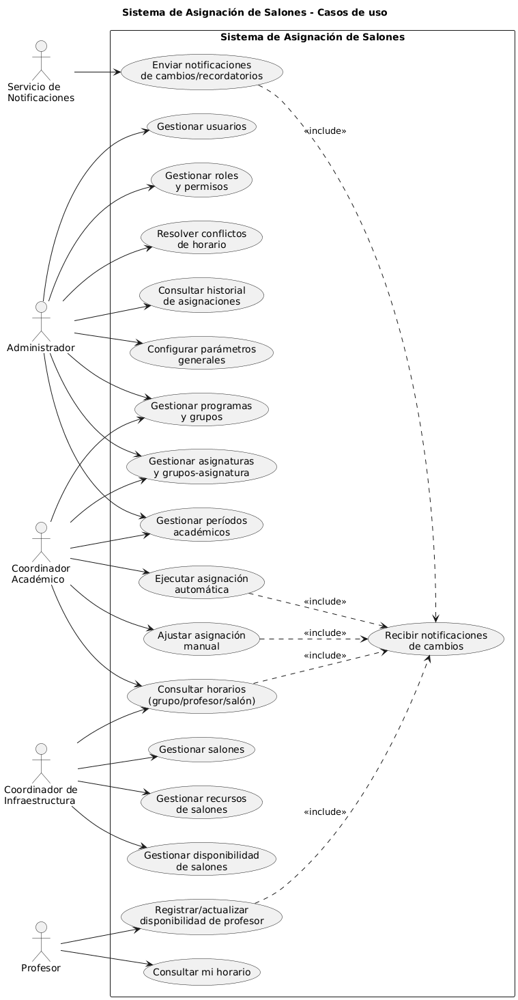

# Diagrama de Casos de Uso: Sistema de Asignación de Salones

## Introducción
Este documento presenta el **diagrama general de casos de uso** del Sistema de Asignación de Salones. Su propósito es mostrar todas las interacciones principales entre los actores y el sistema.

## Diagrama General



## Descripción General
El diagrama muestra los siguientes actores:
- **Administrador**
- **Coordinador Académico**
- **Coordinador de Infraestructura**
- **Profesor**
- **Servicio de Notificaciones**

Cada uno interactúa con casos de uso como:
- Gestión de usuarios
- Gestión de roles y permisos
- Resolver conflictos de horario
- Gestionar programas y grupos
- Registrar disponibilidad de profesores
- Ajustar asignación manual
- Ejecutar asignación automática
- Consultar horarios

---

## Código Mermaid (opcional)
Puedes reemplazar este Mermaid con uno real si lo deseas:

```mermaid
flowchart TD
    A[Administrador] -->|Gestionar usuarios| B(Usuarios)
    A -->|Gestionar roles| C(Roles y Permisos)
    D[Coordinador Académico] -->|Ejecutar asignación automática| E(Asignación Automática)
    D -->|Consultar horarios| F(Horarios)
    G[Profesor] -->|Registrar disponibilidad| H(Disponibilidad)

